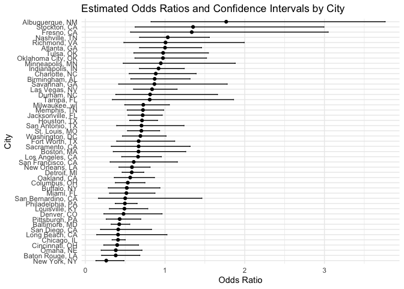
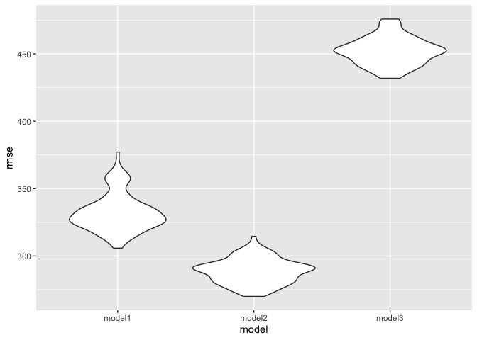

p8105_hw6_qc2337
================

``` r
library(tidyverse)
```

    ## ── Attaching core tidyverse packages ──────────────────────── tidyverse 2.0.0 ──
    ## ✔ dplyr     1.1.4     ✔ readr     2.1.5
    ## ✔ forcats   1.0.0     ✔ stringr   1.5.1
    ## ✔ ggplot2   3.5.1     ✔ tibble    3.2.1
    ## ✔ lubridate 1.9.3     ✔ tidyr     1.3.1
    ## ✔ purrr     1.0.2     
    ## ── Conflicts ────────────────────────────────────────── tidyverse_conflicts() ──
    ## ✖ dplyr::filter() masks stats::filter()
    ## ✖ dplyr::lag()    masks stats::lag()
    ## ℹ Use the conflicted package (<http://conflicted.r-lib.org/>) to force all conflicts to become errors

``` r
library(p8105.datasets)
library(ggplot2)
library(modelr)
library(purrr)
set.seed(1)
```

# Problem 2

``` r
 homicide_df =  
   read_csv("data/homicide_data.csv", na = c("NA","Unknown",".","")) |> 
   janitor::clean_names()
```

    ## Rows: 52179 Columns: 12
    ## ── Column specification ────────────────────────────────────────────────────────
    ## Delimiter: ","
    ## chr (8): uid, victim_last, victim_first, victim_race, victim_sex, city, stat...
    ## dbl (4): reported_date, victim_age, lat, lon
    ## 
    ## ℹ Use `spec()` to retrieve the full column specification for this data.
    ## ℹ Specify the column types or set `show_col_types = FALSE` to quiet this message.

create “city_state” variable, filter specific cities and restrict the
race, edit the age type.

``` r
 homicide_clean_df = 
  homicide_df |> 
  mutate(
    city_state = paste(city, state, sep = ", "),
    solved = ifelse(disposition == "Closed by arrest", 1, 0),
    victim_age = as.numeric(victim_age) 
  ) |> 
  filter(
    !city_state %in% c("Dallas, TX", "Phoenix, AZ", "Kansas City, MO", "Tulsa, AL"),  
    victim_race %in% c("White", "Black")  
  )
```

fit a logistic regression for city of Baltimore

``` r
baltimore_df = 
  homicide_clean_df |> 
  filter(city_state == "Baltimore, MD")

fit_logistic = glm(
  solved ~ victim_age + victim_sex + victim_race, data = baltimore_df, family = binomial())

fit_logistic |> 
  broom::tidy(conf.int = TRUE) |> 
  filter(term == "victim_sexMale") |> 
  mutate(
    OR = exp(estimate),
    CI_low = exp(conf.low),
    CI_high = exp(conf.high)
     ) |> 
  select(OR, CI_low, CI_high) |> 
  knitr::kable(digits = 3)
```

|    OR | CI_low | CI_high |
|------:|-------:|--------:|
| 0.426 |  0.324 |   0.558 |

From the table we know that the adjusted odds ratio is 0.426, the 95%CI
for solving homicides comparing male victims to female victims lies
between (0.324, 0.558).

run GLM for each city.

``` r
fit_logistic_eachcity = function(data) {
  glm_results = glm(solved ~ victim_age + victim_sex + victim_race, data = data, family = binomial())  |> 
    broom::tidy(conf.int = TRUE) |> 
    filter(term == "victim_sexMale") |> 
    mutate(
     OR = exp(estimate),
     CI_low = exp(conf.low),
     CI_high = exp(conf.high)
   )
   
    data.frame(
    city_state = unique(data$city_state),
    OR = glm_results$OR,
    CI_low = glm_results$CI_low,
    CI_high = glm_results$CI_high
  )
}
  
results = homicide_clean_df |> 
  group_by(city_state) |> 
  group_split() |> 
  map_df(fit_logistic_eachcity) 

print(results)
```

    ##            city_state        OR    CI_low   CI_high
    ## 1     Albuquerque, NM 1.7674995 0.8247082 3.7618597
    ## 2         Atlanta, GA 1.0000771 0.6803477 1.4582575
    ## 3       Baltimore, MD 0.4255117 0.3241908 0.5575508
    ## 4     Baton Rouge, LA 0.3814393 0.2043481 0.6836343
    ## 5      Birmingham, AL 0.8700153 0.5713814 1.3138409
    ## 6          Boston, MA 0.6673219 0.3508461 1.2600381
    ## 7         Buffalo, NY 0.5205704 0.2884416 0.9358300
    ## 8       Charlotte, NC 0.8838976 0.5507440 1.3905954
    ## 9         Chicago, IL 0.4100982 0.3361233 0.5008546
    ## 10     Cincinnati, OH 0.3998277 0.2313767 0.6670456
    ## 11       Columbus, OH 0.5324845 0.3770457 0.7479124
    ## 12         Denver, CO 0.4790620 0.2327380 0.9624974
    ## 13        Detroit, MI 0.5823472 0.4619454 0.7335458
    ## 14         Durham, NC 0.8123514 0.3824420 1.6580169
    ## 15     Fort Worth, TX 0.6689803 0.3935128 1.1211603
    ## 16         Fresno, CA 1.3351647 0.5672553 3.0475080
    ## 17        Houston, TX 0.7110264 0.5569844 0.9057376
    ## 18   Indianapolis, IN 0.9187284 0.6784616 1.2413059
    ## 19   Jacksonville, FL 0.7198144 0.5359236 0.9650986
    ## 20      Las Vegas, NV 0.8373078 0.6058830 1.1510854
    ## 21     Long Beach, CA 0.4102163 0.1427304 1.0241775
    ## 22    Los Angeles, CA 0.6618816 0.4565014 0.9541036
    ## 23     Louisville, KY 0.4905546 0.3014879 0.7836391
    ## 24        Memphis, TN 0.7232194 0.5261210 0.9835973
    ## 25          Miami, FL 0.5152379 0.3040214 0.8734480
    ## 26      Milwaukee, wI 0.7271327 0.4951325 1.0542297
    ## 27    Minneapolis, MN 0.9469587 0.4759016 1.8809745
    ## 28      Nashville, TN 1.0342379 0.6807452 1.5559966
    ## 29    New Orleans, LA 0.5849373 0.4218807 0.8121787
    ## 30       New York, NY 0.2623978 0.1327512 0.4850117
    ## 31        Oakland, CA 0.5630819 0.3637421 0.8671086
    ## 32  Oklahoma City, OK 0.9740747 0.6228507 1.5199721
    ## 33          Omaha, NE 0.3824861 0.1988357 0.7109316
    ## 34   Philadelphia, PA 0.4962756 0.3760120 0.6498797
    ## 35     Pittsburgh, PA 0.4307528 0.2626022 0.6955516
    ## 36       Richmond, VA 1.0060520 0.4834671 1.9936248
    ## 37     Sacramento, CA 0.6688418 0.3262733 1.3143887
    ## 38    San Antonio, TX 0.7046200 0.3928179 1.2382509
    ## 39 San Bernardino, CA 0.5003444 0.1655367 1.4623977
    ## 40      San Diego, CA 0.4130248 0.1913527 0.8301847
    ## 41  San Francisco, CA 0.6075362 0.3116925 1.1551470
    ## 42       Savannah, GA 0.8669817 0.4185827 1.7802453
    ## 43      St. Louis, MO 0.7031665 0.5298505 0.9319005
    ## 44       Stockton, CA 1.3517273 0.6256427 2.9941299
    ## 45          Tampa, FL 0.8077029 0.3395253 1.8598834
    ## 46          Tulsa, OK 0.9757694 0.6090664 1.5439356
    ## 47     Washington, DC 0.6910490 0.4659731 1.0135014

Create a plot

``` r
results_plot = results |> 
  arrange(OR) |> 
  mutate(city_state = fct_inorder(city_state))

results_plot |> 
  ggplot(aes(x = city_state, y = OR)) +
  geom_point() + 
  geom_errorbar(aes(ymin = CI_low, ymax = CI_high), width = 0.2) +
  coord_flip() + 
  labs(
    title = "Estimated Odds Ratios and Confidence Intervals by City",
    x = "City",
    y = "Odds Ratio"
  ) +
  theme_minimal()
```

<!-- -->
Comment: Those cities with OR larger than 1, indicates that no
significant difference in solving rates between male and female
victims.The Albuguergue, NM has the highest OR and widest 95% CI. Other
cities have an apparenthigh OR\>1 are Stockton,CA and Fresno,CA.

# Problem 3

``` r
 birthweight_df =  
   read_csv("data/birthweight.csv", na = c("NA",".","")) |> 
   janitor::clean_names() |> 
   mutate(
     babysex = factor(
       babysex, levels = c(1, 2), 
       labels = c("Male", "Female")),
     frace = factor(
       frace, levels = c(1, 2, 3, 4, 8, 9), 
       labels = c("White", "Black", "Asian", "Puerto Rican", "Other", "Unknown")),
     mrace = factor(
       mrace, levels = c(1, 2, 3, 4, 8, 9), 
       labels = c("White", "Black", "Asian", "Puerto Rican", "Other", "Unknown")),
     malform = factor(
       malform, levels = c(0, 1), labels = c("Absent", "Present"))
  )
```

    ## Rows: 4342 Columns: 20
    ## ── Column specification ────────────────────────────────────────────────────────
    ## Delimiter: ","
    ## dbl (20): babysex, bhead, blength, bwt, delwt, fincome, frace, gaweeks, malf...
    ## 
    ## ℹ Use `spec()` to retrieve the full column specification for this data.
    ## ℹ Specify the column types or set `show_col_types = FALSE` to quiet this message.

Propose a regression model for birthweight

``` r
reg_model = lm(bwt ~ fincome + gaweeks + ppwt + ppbmi + malform + smoken, data = birthweight_df)

summary(reg_model)
```

    ## 
    ## Call:
    ## lm(formula = bwt ~ fincome + gaweeks + ppwt + ppbmi + malform + 
    ##     smoken, data = birthweight_df)
    ## 
    ## Residuals:
    ##      Min       1Q   Median       3Q      Max 
    ## -1829.79  -273.10    -2.11   284.45  1616.28 
    ## 
    ## Coefficients:
    ##                Estimate Std. Error t value Pr(>|t|)    
    ## (Intercept)    190.6079    96.4950   1.975   0.0483 *  
    ## fincome          2.0201     0.2674   7.554 5.11e-14 ***
    ## gaweeks         63.6957     2.1854  29.146  < 2e-16 ***
    ## ppwt             8.1050     0.6576  12.326  < 2e-16 ***
    ## ppbmi          -29.9690     4.1563  -7.211 6.55e-13 ***
    ## malformPresent  76.6696   116.6447   0.657   0.5110    
    ## smoken          -7.5501     0.9285  -8.132 5.48e-16 ***
    ## ---
    ## Signif. codes:  0 '***' 0.001 '**' 0.01 '*' 0.05 '.' 0.1 ' ' 1
    ## 
    ## Residual standard error: 450.7 on 4335 degrees of freedom
    ## Multiple R-squared:  0.2267, Adjusted R-squared:  0.2256 
    ## F-statistic: 211.8 on 6 and 4335 DF,  p-value: < 2.2e-16

``` r
birthweight_model = 
  birthweight_df |>
  add_predictions(reg_model) |>
  add_residuals(reg_model)

ggplot(birthweight_model, aes(x = pred, y = resid))+
  geom_point(alpha = 0.5) + 
  geom_smooth() +
  labs(
       title = "Plot of Residuals vs. Fitted Values",
       x = "Fitted Values",
       y = "Residuals") +
  theme_minimal()
```

    ## `geom_smooth()` using method = 'gam' and formula = 'y ~ s(x, bs = "cs")'

<!-- -->
Describe modeling process: The model includes family monthly income
(fincome), gestational weeks (gaweeks),pre-pregnancy weight (ppwt),
mother’s pre-pregnancy BMI (ppbmi) + presence of malformations that
could affect weight (malform) and average number of cigarettes smoked
per day during pregnancy (smoken) as predictors. These choices are based
on both social economic status and biological relevance to birthweight.
I also checked the model summary to see the significance of predictors
and overall model statistics.

Compare the model to two others

``` r
models = list(
  model1 = lm(bwt ~ gaweeks + blength, data = birthweight_df),
  model2 = lm(bwt ~ bhead * blength * babysex, data = birthweight_df),
  model3 = lm(bwt ~ fincome + gaweeks + ppwt + ppbmi + malform + smoken, data = birthweight_df))

cv_df =
  crossv_mc(birthweight_df, 100) |> 
  mutate(
    train = map(train, as_tibble),
    test = map(test, as_tibble))

cv_df = 
  cv_df |> 
  mutate(
    model1 = map(train, \(df)  lm(bwt ~ gaweeks + blength, data = df)),
    model2 = map(train, \(df)  lm(bwt ~ bhead * blength * babysex, data = df)),
    model3 = map(train, \(df)  lm(bwt ~ fincome + gaweeks + ppwt + ppbmi + malform + smoken, data = df))) |> 
  mutate(
    rmse_model1 = map2_dbl(model1, test, \(mod, df)  rmse(model = mod, data = df)),
    rmse_model2 = map2_dbl(model2, test, \(mod, df)  rmse(model = mod, data = df)),
    rmse_model3 = map2_dbl(model3, test, \(mod, df)   rmse(model = mod, data = df)))

cv_df |> 
  select(starts_with("rmse")) |> 
  pivot_longer(
    everything(),
    names_to = "model", 
    values_to = "rmse",
    names_prefix = "rmse_") |> 
  mutate(model = fct_inorder(model)) |> 
  ggplot(aes(x = model, y = rmse)) + geom_violin()
```

<!-- -->
Comment: model 1 shows a broad RMSE distribution, predominantly centered
around the 350 to 400 range. This suggests a moderate level of
prediction error but with some variability across different
cross-validation splits. Model 2 consistently shows the lowest RMSE,
suggesting it is the most accurate model for predicting birthweight
based on the available predictors. model 3 has the widest and most
varied RMSE distribution, with values ranging significantly from below
300 to above 400. The distribution is somewhat bimodal, suggesting two
potential ‘modes’ of performance depending on the training/test split.
This might indicate overfitting or high sensitivity to the specific
training data used. based on the violin plot, Model 2 is recommended as
the best choice among the three due to its combination of low and stable
RMSE values, indicating good and reliable predictive performance.
